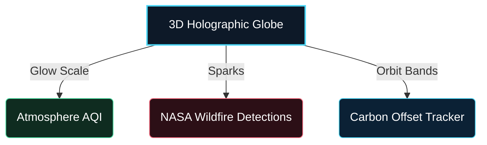

<p align="center">
  
  
  
  
  
  
</p>

<h1 align="center">💚 EcoSentinel 💙</h1>

<p align="center">
  <b>An enterprise-grade, high-fidelity environmental intelligence platform.</b><br />
  Features immersive WebGL 3D telemetry visualization, active satellite wildfire plume tracking, computer-vision waste classification, and real-time audio-wave assistant channels.
</p>

---

## 🎨 Immersive Design System

EcoSentinel adopts a premium **Midnight Blue & Neon Glassmorphism** dark aesthetic:
* 🌌 **Midnight Foundation** (`#0c1321`): Deep immersive workspace.
* 💎 **Cobalt Sky Glow** (`#4cd7f6`): Interactive accents, audio waves, and data tracks.
* 🌿 **Vibrant Emerald** (`#4edea3`): Successful achievements and safe outdoor windows.
* 🔥 **Rose Ember** (`#fb7185`): Active thermal anomalies and warning highlights.

---

## ⚡ Core Features & Capabilities



### 🛰️ 1. Spatial Telemetry & Plume Modeling
* **Interactive 3D Globe**: Renders a dynamic vector particle globe using WebGL. Automatically shifts its atmospheric neon shell color based on regional PM2.5 levels.
* **NASA Wildfire Tracker**: Plots NASA FIRMS coordinates with concentric, wind-tilted active smoke plume dispersion models, highlighting downwind impact sectors.

### 👁️ 2. High-Tech AR Waste Scanner
* **HUD Overlay**: Simulated camera viewport featuring coordinates lookup, target system locks, and digital scanning vectors.
* **Matrix Sweep**: A glowing laser-bar sweep overlay animating during Gemini Pro Vision classification.
* **3D Tilt Card**: Interactive results card that tilts dynamically in 3D perspective tracking your mouse.

### 🎙️ 3. Audio-Responsive Voice AI
* **Wave Canvas**: HTML5 Web Audio visualizer drawing pulsing circular frequency rings around the mic.
* **Smart Grounding**: LLM assistant grounded in real-time localized telemetries (Fires, Stations, and Forecasts).

### 📈 4. Multi-Pollutant Forecasting
* **Dynamic Time Series**: Parallel Prophet model predictions for PM2.5, CO₂, and NO₂.
* **Safety Thresholds**: Reference lines and safe outdoor window suggestions update dynamically based on the selected pollutant parameter.

---

## 🛠️ Technology Stack

| Layer | Technologies |
| :--- | :--- |
| **Frontend** | Next.js 16 (App Router) · React 19 · TypeScript · Tailwind CSS v4 · Three.js · Leaflet · Recharts · Framer Motion |
| **Backend** | FastAPI · SQLModel (Pydantic v2 + SQLAlchemy) · Alembic Migrations · PostgreSQL / SQLite |
| **Services** | Google Gemini API (Vision) · Facebook Prophet (Time Series) · OpenAI Whisper (Speech-to-Text) |

---

## ⚙️ Quick Start

<details>
<summary>📂 <b>Backend Setup (FastAPI)</b></summary>

```bash
cd backend
python -m venv .venv
source .venv/bin/activate  # Windows: .\.venv\Scripts\activate
pip install -r requirements-base.txt
cp .env.example .env       # Configure GEMINI_API_KEY, FIRMS_API_KEY, etc.
alembic upgrade head
uvicorn main:app --host 127.0.0.1 --port 8005 --reload
```
</details>

<details>
<summary>💻 <b>Frontend Setup (Next.js)</b></summary>

```bash
cd frontend
npm install
cp .env.example .env.local  # Set NEXT_PUBLIC_API_URL=http://localhost:8005
npm run dev -- -p 3005
```
</details>

---

## 🧪 Verification & Health Checks

* **Backend Tests**: `cd backend && pytest -v` (100% test suite verified).
* **Frontend Compilation**: `cd frontend && npm run build` (Static compiler checks verified).
